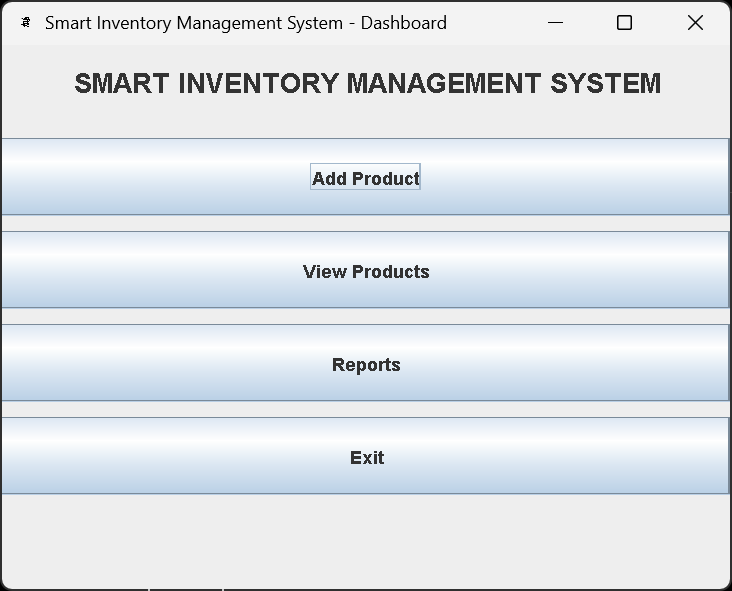
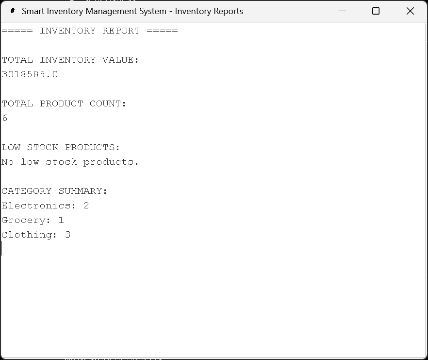

# Smart Inventory Management System

The Smart Inventory Management System is a desktop application built with Java Swing and Object-Oriented Programming concepts. It aims to make inventory management easier through an interactive GUI and showcases solid software development practices like layered architecture, CRUD operations, file handling, reporting, and multithreading.

---

# Key Features

## Secure Login System

The application starts with an admin login screen that checks user credentials before allowing access to the dashboard and features.

---

## Product Management

Users can manage inventory through an easy-to-use interface. The system lets you:

* Add new products
* Update product quantities
* Delete products
* Search for products
* View all inventory records in a JTable

---

## Product Categories

To show inheritance and polymorphism, the system supports multiple product categories, including:

* Electronics
* Grocery
* Clothing

Each category has its own unique attributes, such as:

* Warranty Period for electronics
* Expiry Date for grocery items
* Size information for clothing products

---

# CRUD Functionality

The application fully supports CRUD operations:

| Operation | Function                           |
| --------- | ---------------------------------- |
| Create    | Add new products                   |
| Read      | Display inventory records          |
| Update    | Modify product details or quantity |
| Delete    | Remove products from inventory     |

---

# File Handling & Data Persistence

Inventory data is stored using file handling methods, ensuring product information is retained after closing the application.

Data is saved in:

```text
data/products.txt
```

The system automatically:

* Loads saved data when the application starts
* Updates records after each CRUD operation

This makes the application reliable and user-friendly without needing a database.

---

# Reporting & Analytics

The system features a reporting dashboard that provides helpful inventory insights like:

* Total inventory value
* Total number of products
* Low-stock product alerts
* Category-wise inventory summary

---

# Multithreading Support

A separate background thread monitors stock levels without slowing down the GUI.

Its tasks include:

* Detecting low-stock products
* Running periodic checks with `Thread.sleep()`
* Operating independently from the main application interface

---

# GUI Modules

The project includes several Java Swing-based screens, such as:

* Login Screen
* Dashboard
* Add Product Form
* Product Management Table
* Reports Dashboard

The graphical interface makes the application interactive, organized, and easy to navigate.

---

# Technologies Used

| Technology            | Purpose                          |
| --------------------- | -------------------------------- |
| Java                  | Core programming language        |
| Java Swing            | GUI development                  |
| Collections Framework | Product data storage             |
| File Handling         | Data persistence                 |
| Multithreading        | Background stock monitoring      |
| OOP Concepts          | Software design and architecture |

---

# OOP Concepts Applied

This project emphasizes Object-Oriented Programming principles, including:

* Abstraction
* Encapsulation
* Inheritance
* Polymorphism
* Method Overriding
* Constructor Overloading
* Custom Exception Handling

---

# Project Structure

```text
src/
│
├── model
├── service
├── ui
├── util
├── exception
├── thread
└── main
```

### Package Overview

| Package   | Responsibility                       |
| --------- | ------------------------------------ |
| model     | Product classes and inheritance      |
| service   | Business logic and reporting         |
| ui        | Swing-based user interfaces          |
| util      | Utility classes and session handling |
| exception | Custom exception handling            |
| thread    | Background monitoring tasks          |
| main      | Application entry point              |

---

# Application Workflow

1. The user logs into the system.
2. The dashboard provides access to different modules.
3. Products can be added, updated, searched, or deleted.
4. Inventory data is automatically saved.
5. Reports display inventory statistics and analytics.
6. A background thread continuously monitors stock levels.

---

# Validation Features

To increase reliability, the system includes validations such as:

* Empty field validation
* Prevention of duplicate product IDs
* Invalid quantity checks
* Invalid price validation

---

# Future Enhancements

Some planned improvements for the future include:

* Integrating a database using MySQL or MongoDB
* Advanced product search and filtering
* Sales and billing management
* Role-based authentication system
* REST API integration
* Cloud deployment support

---

# Screenshots

* Login Screen


* Dashboard



* Add Product Form


* Product Table


* Reports Dashboard



---

# How to Run the Project

## Clone the Repository

```bash
git clone <repository-link>
```

---

## Open the Project

You can open the project in:

* VS Code
* IntelliJ IDEA

---

## Run the Application

Run the following file:

```text
Main.java
```

Located inside:

```text
src/main/
```

---

# Learning Outcomes

This project provided practical experience with:

* Java Swing GUI development
* Layered software architecture
* Object-Oriented Programming concepts
* File handling and persistence
* Multithreading implementation
* CRUD-based application development
* Event-driven programming